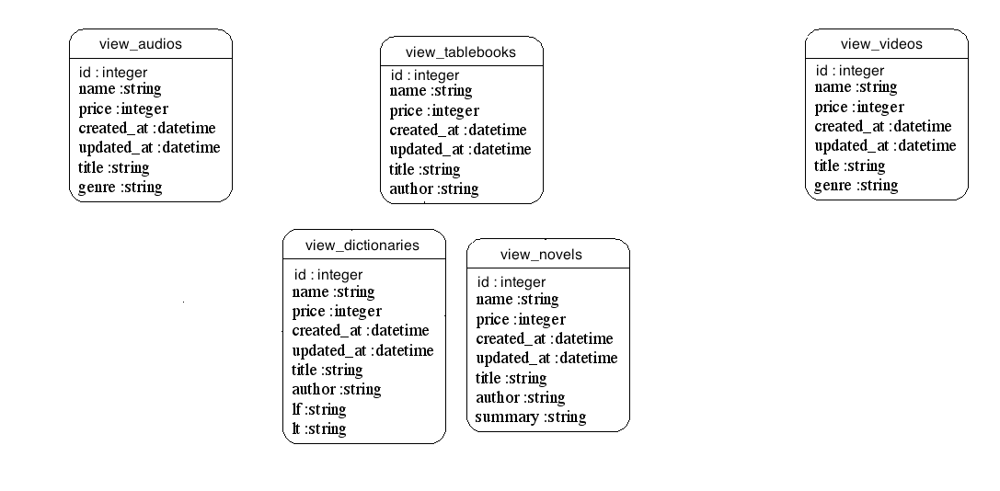
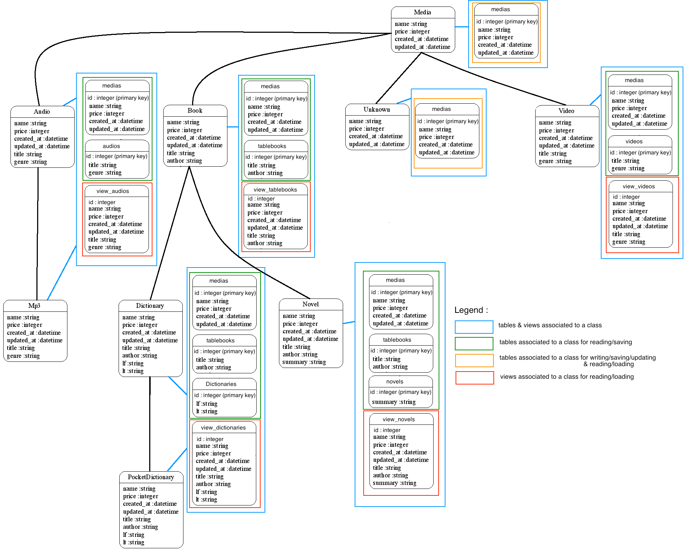

A New Solution
==================

**Embedding Ruby Class Inheritance & Multiple Table Inheritance through use of Ruby Class Inheritance & Databases Views**

As for now, we have seen that except the Database Management System based solutions which may be based upon a special feature of PostgreSQL RDBMS (and which intrinsically rely on the use of PostgreSQL) there is no completely satisfying solution for solving our class inheritance and multiple table inheritance problem. We have recently decided to create a plugin that would allow solving such a problem. Our solution named CITIER was designed after a close look at the existing solutions and we want to thank here their authors for letting their code at community's disposal. We won't get here into a deep technical explanation of how our solution works but just give some very low level insights (maybe in near future we'll provide some more details ; yet, interested reader should refer to our commentated code, which can be grabbed here). Thereafter, we first introduce features offered by our solution, give some brief informations related to the basic ideas that drove us for implementing this solution, and finally explain how to use it. Obviously, the explanations concerning the implementation of this solution may be not clear enough, but you could still skip them and still use our gem efficiently. Maybe, the best idea to understand completely the job done would be to investigate the commentated code.

A Full Featured Solution
------------------------

- Not RDBMS dependent
This solution can be used with probably every RDBMS (actually, we only tested with SQLite, MySQL and PostgreSQL, but it should work with other RDBMS with very minor changes). This feature is obviously not included in RDBMS based solutions.

- Real Ruby Class Inheritance & Real is_a relationships :
This solution is firstly based on Ruby's class inheritance. For our example, the inheritance hierachy is the one that a programmer would expect (see it here). This means that if you have defined some instance methods/variables or class methods/variables in a superclass you can have a natural access to it. This also means that a real "is_a" relationship is used and that multi level inheritance hierarchy can be modeled. This feature is not included in any other solution.

- Efficient Storing :
To efficiently store attributes of modeled classes, the database schema used respects the class inheritance. The database schema is such that no information is stored twice. To do so we create a table for each node of the class hierarchy such that the node has at least one specific attribute (specific attributes of a class are attributes that are not included into its superclass). For our example that means that we have a schema with the following tables :
	- Table1 (we call it 'medias' through the rest of this post) which is associated to the Media class node for storing 'price' and 'name' attributes (for Media class and all its derivated classes : Audio, Mp3, Video, Book, Novel, Dictionary, Pocket Dictionary, Unknown)
	- Table2 (we call it 'audios' through the rest of this post) which is associated to the Audio class node for storing 'title' and 'genre' attributes (for Audio class and all its derivated class Mp3)
	- Table3 (we call it 'videos' through the rest of this post) which is associated to the Video class node for storing 'title' and 'genre' attributes (for Video class)
	- Table4 (we call it 'tablebooks' through the rest of this post) which is associated to the Book class node for storing 'author' and 'title' attributes (for Book class and all its derivated classes : Novel, Dictionary, Pocket Dictionary, Unknown)
	- Table5 (we call it 'novels' through the rest of this post) which is associated to the Novel class node for storing 'summary' attribute (for Novel class)
	- Table6 (we call it 'dictionaries' through the rest of this post) which is associated to the Dictionary class node for storing 'language1' and 'language2' attributes (for Dictionary class and all its derivated class : Pocket Dictionary)

Note that no Table is associated to Mp3, PocketDictionary, Unknown nodes since they don't have any specific attribute. With such a schema we are able to store efficiently the attributes of each class instances. This feature is not included in Single Table Based solutions.

**Database Schema**

Solution Philosophy
-------------------

The philosophy used to implement this solution is the following, for each node of the class hierarchy ([see it here](http://altrabio.github.com/CITIEsForRAILS/index.html#classhierarchy)) (does not depend on the fact that it has or not any specific attribute) we would like to use ActiveRecord facilities to manipulate it (this means using ActiveRecord facilities to save an object, update an object, load an object, read an object's attributes, destroy an object...). Using classically ActiveRecords would imply to use a specific table for each class, yet this would not respect the constraints required related to the storage. (this would not fit with our database schema constraints defined before, [see it here](http://altrabio.github.com/CITIEsForRAILS/index.html#databaseschema)).

So what we propose here is just to have a mechanism that fake the existence of these tables while not requiring them. Our solution is actually based on a database schema such as the one needed.

The idea is basically to use the database schema proposed and to associate one/several defined tables for each class node of the hierarchy (this tables will be used for saving/storing/updating informations for objects) and to associate to each class node one virtual table (database views) or a table that will be accessed for loading/reading informations. Then the idea is to override some ActiveRecord methods in order to propose to the user a classical use of ActiveRecord functionalities. The overriding will in fact consists in switching from the virtual table (the view) to the real tables whenever it is needed. You need the virtual table for loading/reading informations and the real tables for saving/updating informations. This is not clear ? Hopefully the use of the gem does not need any good understanding of how it works, and furthermore won't change your habits as far as the use of ActiveRecord functionalities are concerned. Yet I just give know some simple drawings that try to illustrate what happen behind the curtains when using our gem:
**Database Views**

For a detailed picture what the class heirarchy & associated tables/views look like, see below (click to enlarge).

